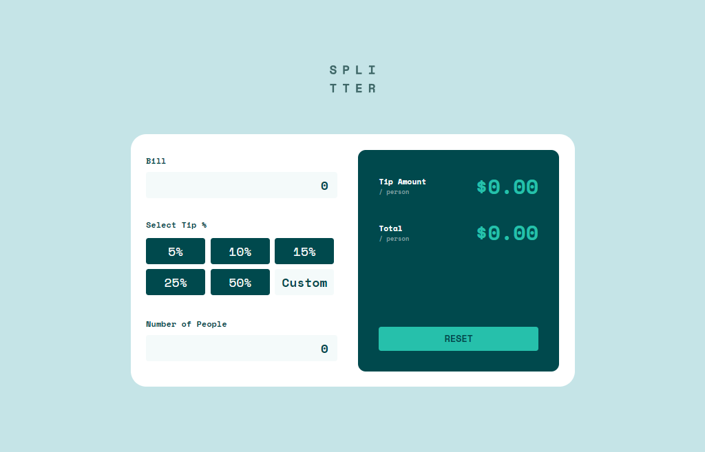
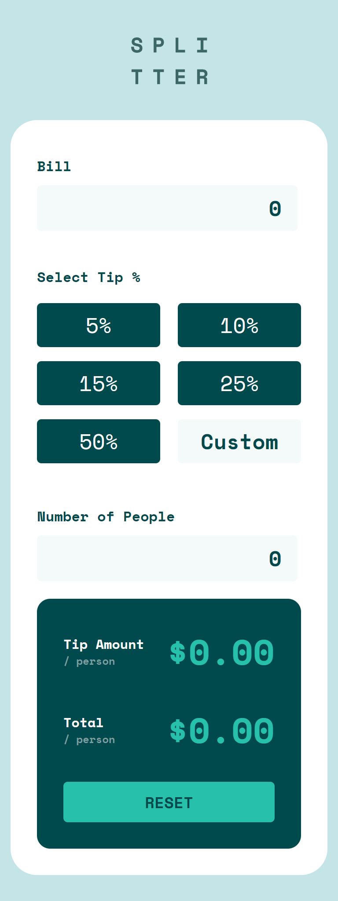

# Frontend Mentor - Tip calculator app solution

This is a solution to the [Tip calculator app challenge on Frontend Mentor](https://www.frontendmentor.io/challenges/tip-calculator-app-ugJNGbJUX). Frontend Mentor challenges help you improve your coding skills by building realistic projects.

## Table of contents

  - [Overview](#overview)
    - [The challenge](#the-challenge)
    - [Screenshot](#screenshot)
      - [Desktop](#desktop)
      - [Mobile](#mobile)
    - [Links](#links)
  - [My process](#my-process)
    - [Built with](#built-with)
  - [Author](#author)

## Overview

### The challenge

Users should be able to:

- View the optimal layout for the app depending on their device's screen size
- See hover states for all interactive elements on the page
- Calculate the correct tip and total cost of the bill per person

### Screenshot

#### Desktop

#### Mobile

### Links

- [Solution](https://www.frontendmentor.io/solutions/tip-calculator-app-S1XlHPVN9)
- [Live Site](https://risclover.github.io/tip-calculator-app)
  
## My process

### Built with

- Semantic HTML5 markup
- CSS
- Flexbox

## Author

- Website - [Sara Dunlop](https://risclover.github.io)
- Frontend Mentor - [@Risclover](https://www.frontendmentor.io/profile/Risclover)